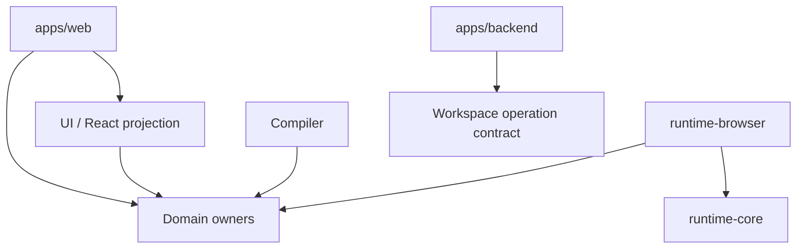

# 架构与 Package Owner

Prodivix 采用“Canonical documents + domain owners + revision-bound projections”的架构。应用只组合能力，稳定契约归 package。

## 核心 owner

| Package                        | 稳定职责                                                                                                  |
| ------------------------------ | --------------------------------------------------------------------------------------------------------- |
| `@prodivix/workspace`          | Canonical Workspace model、codec、validator、Command、Transaction、History 与 snapshot composition        |
| `@prodivix/workspace-sync`     | Revision、semantic conflict、Atomic Commit plan、Durable Outbox 与 local replica                          |
| `@prodivix/pir`                | PIR-current normalize、graph mutation、Component/Collection 与 semantic contribution                      |
| `@prodivix/router`             | RouteManifest、codec、match/navigation 与 semantic contribution                                           |
| `@prodivix/nodegraph`          | DOM-free contract、executor、deterministic trace、same-context ExecutionProvider 与 semantic contribution |
| `@prodivix/animation`          | Animation contract、evaluator、Runtime Port、same-context ExecutionProvider 与 semantic contribution      |
| `@prodivix/data`               | DataSourceDocument、DataOperationReference、wire codec、policy/lifecycle 与 semantic contribution         |
| `@prodivix/runtime-core`       | Runtime port、ExecutionProvider/Job、Execution Session、test report 与 reference-only environment/Secret  |
| `@prodivix/runtime-browser`    | 共享 Browser Runtime Host、独立 Preview/Test provider、Vite/HMR、Vitest adapter 与 Animation effect port  |
| `@prodivix/pir-react-renderer` | PIR 的 React projection，不拥有作者态真相                                                                 |
| `@prodivix/authoring`          | Semantic Index contract/query，以及 CodeArtifact/Reference/Slot 基础                                      |
| `@prodivix/code-language`      | TS/JS/CSS/SCSS/GLSL/WGSL language session 与 shader compile capability                                    |
| `@prodivix/diagnostics`        | Issues contract、provider snapshot、去重与 presentation                                                   |
| `@prodivix/tokens`             | DTCG token/resolver current model、resolution 与 semantic contribution                                    |
| `@prodivix/prodivix-compiler`  | Domain compiler、Export Program 与 Production Export Planner                                              |
| `@prodivix/golden-conformance` | Living Golden App 与产品 Gate conformance                                                                 |

UI、plugin、i18n 与 debugger package 也各自拥有公开契约，但不应承接上述领域的临时副本。

## 应用边界

`apps/web` 只负责 React 编辑器表面、browser adapter 和 composition root。它不得重新拥有 Runtime、Router、NodeGraph、Animation、PIR Renderer、Workspace Sync 或 Authoring Core。

`apps/backend` 负责 canonical persistence、Atomic Commit、权限与服务边界。Project 只保存项目元数据与显式 publication projection，不保存 PIR 作者态镜像。

## 稳定依赖方向

领域层不能依赖 React、DOM、fetch transport 或编辑器内部 store。跨领域语义通过 Semantic Contribution/Query 协作，不互相扫描内部结构。

## Browser 执行宿主边界

`BrowserProjectRuntimeHost` 是 Web composition root 持有的长期资源，统一管理 browser Node runtime、工程文件、dependency fingerprint/install、owner-scoped process 与 dispose。Preview 和 Test 使用不同的 provider descriptor、ExecutionJob 与 Execution Session，只共享 Host 的 filesystem、依赖安装和 runtime；一方不能接管另一方的 active Job、取消或结果。

Test provider 运行 exact Workspace revision 生成的独立 React/Vite snapshot。Vitest 等工具私有结果只在 `@prodivix/runtime-browser` adapter 边界解码，随后以 `@prodivix/runtime-core` 的 `ExecutionTestReport`、trace 和 artifact 进入 Web。测试报告是可丢弃运行态，不是 Workspace 文档，也不自动成为 VerificationEvidence。

## Data 与执行环境边界

`@prodivix/data` 定义无版本号 current DataSourceDocument、DataOperationReference、schema、query/mutation、policy、lifecycle 与 wire codec。Canonical Workspace 以 `data-source` document 持久化作者态，并把 source/schema/operation contribution 组合进 revision-bound Semantic Index。现有 PIR `dataId` 仍是文档内局部数据作用域，不是全局 operation identity。

ExecutionEnvironmentSnapshotRef、EnvironmentBindingReference 与 SecretRef 当前只携带 identity。带 environment reference 的 ExecutionRequest 自动要求 provider `environment-binding` capability；不支持的 provider 在兼容性检查阶段拒绝。Secret value 不进入 Workspace、request、log、artifact 或客户端产物。当前 strict shape 不会从任意 literal 的名字或内容猜测秘密；adapter configuration schema、Secret resolver、runtime-zone permission、PIR binding 与 Preview/Export CRUD execution 仍属于后续 G2 纵切。

## 生产模型演进

Alpha 阶段直接收敛当前目标架构，不保留旧兼容层。PIR、Token 等生产 API 使用无版本 current model；wire version 与 migration 集中在 persistence 边界。

更完整的决策依据在仓库 `specs/decisions/`。全局阶段只以 `specs/roadmap/global-phases.md` 为准。
