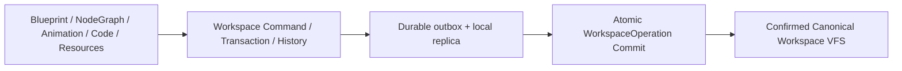

# 简介

Prodivix 是一款处于 alpha 阶段的浏览器原生 Web 应用作者环境。长期目标是让蓝图、节点图、动画与代码在同一个 Workspace 中协作，并让预览、导出、诊断和验证共享可追溯的语义链路。

当前产品阶段是 **G0 Passed / G1 Foundation**：Truth & Change Kernel 已形成可重复验证的闭环，语义化的视觉与代码混合作者环境仍在建设。架构文档中的长期能力不等于已经交付的产品功能。

## 核心原则

### Canonical Workspace VFS 是唯一作者态真相

Workspace VFS 统一持有：

- Workspace metadata 与 Route Manifest
- PIR page、layout 与 component documents
- 独立的 NodeGraph (`pir-graph`) 与 Animation (`pir-animation`) documents
- Code Documents、Assets 与 Project Config

PIR 是 Workspace 中的核心领域文档，但不是整个项目的唯一真相源。PIR 内部的 UI 保存态使用规范化的 `ui.graph`；需要树结构时，通过 `materializeUiTree` 生成临时读取视图，而不是再保存一份可漂移的树。

### 所有领域修改共享一条写入路径



编辑器先通过 `@prodivix/workspace` 形成 Command 或 Transaction，并记录可撤销、重做和审计的 History。远端 exact request 在发送前进入 `@prodivix/workspace-sync` 的 durable outbox，再由后端执行强幂等 Atomic Commit。Settings 使用独立的 durable outbox 与 Settings Commit。

旧 document `PATCH`、`POST /intents`、Project PIR 作者态镜像以及绕过 outbox 的直写入口已经被 Hard Cut。

### Core package 拥有领域语义，Web 负责组合

| 能力域                                                | 当前 owner                                             |
| ----------------------------------------------------- | ------------------------------------------------------ |
| Workspace VFS、Command、Transaction、History          | `@prodivix/workspace`                                  |
| Outbox、local replica、revision conflict、commit wire | `@prodivix/workspace-sync`                             |
| PIR graph、materialization、normalization、validation | `@prodivix/pir`                                        |
| Route contract、codec、matching 与 validation         | `@prodivix/router`                                     |
| NodeGraph / Animation 领域内核                        | `@prodivix/nodegraph` / `@prodivix/animation`          |
| Runtime contract 与浏览器 adapter                     | `@prodivix/runtime-core` / `@prodivix/runtime-browser` |
| Code Authoring / Symbol Environment                   | `@prodivix/authoring`                                  |
| 诊断 contract、registry 与 presentation               | `@prodivix/diagnostics`                                |
| React PIR projection                                  | `@prodivix/pir-react-renderer`                         |
| Workspace / PIR export                                | `@prodivix/prodivix-compiler`                          |

`apps/web` 不再拥有 `src/core`、私有 PIR renderer、私有 Router Core 或私有 PIR validator。Web 中仍存在的 `src/pir` 与 `src/router` 只承载应用专用 adapter。

## 三编辑器与共享代码作者环境

Prodivix 保持三种主要视觉编辑器：

- **Blueprint** 维护 PIR UI graph、属性、布局和事件绑定。
- **NodeGraph** 维护逻辑图及其端口与执行语义。
- **Animation** 维护 timeline、binding、track、filter 与关键帧。

复杂 handler、executor、mounted CSS、adapter、easing、shader 和 timeline script 不应作为裸字符串散落在编辑器状态中。它们通过 CodeSlot 指向 Workspace code document / CodeArtifact，由共享 Code Authoring Environment 提供 CodeReference、符号、作用域与诊断查询。

当前已经存在 CodeArtifact、CodeReference、CodeSlot、Authoring Registry 与 CodeMirror/Monaco 相关基础，但真实 TypeScript/JavaScript/CSS/GLSL/WGSL Language Service、definition/reference/rename、稳定 visual/code round-trip 和完整代码工作区尚未通过 G1 Gate。

## 当前产品状态

### G0：Passed

`pnpm run verify:g0` 已验证以下非浏览器 Truth & Change Kernel 边界：

- Canonical Workspace VFS 与单一生产写入协议
- Command / Transaction History、undo/redo 与 replay
- Operation / Settings 双 durable outbox、正式 local replica 与恢复
- Atomic Commit、revision partition、强幂等与显式冲突解决
- Workspace、Route 与 PIR 的 codec / semantic validation 组合
- Issues 聚合、稳定 target、SourceSpan、Quick Fix 边界与编辑器回跳
- Living Golden App 的创建、编辑、保存规划、恢复、冲突、完整 Workspace React/Vite export 与进程内 build

G0 通过不包含浏览器行为、视觉回归、独立导出项目安装和完整应用交付链。

### G1：Foundation

G1 正在建立语义化的视觉与代码混合作者环境。当前已有 Code Authoring contract、Workspace code documents、React/Vite export 与 SourceTrace 基础；以下关键 Gate 仍未通过：

- 真实 Language Service 与增量索引
- visual/code 双向 round-trip，且未知代码不丢失
- 从各编辑器和 Issues 跳转到真实 definition / reference
- 独立导出项目的 install、typecheck、test、build 与 browser smoke
- 稳定、可验证的 Component Contract

### 其他能力

- NodeGraph 已有独立领域 package 和执行内核，Animation 已有 contract、normalizer、基础 evaluator 与浏览器 preview projection；完整跨域行为验证仍属于后续 Gate。
- Plugin Host、Browser Sandbox 与 Ant Design / MUI / Radix 官方插件已有较多基础，但 public SDK、签名、Marketplace 与完整 conformance 尚未完成。
- AI gateway、provider、streaming、tool 与 trace 有基础；真实 Workspace 写入必须继续走 Command、outbox、验证与审阅链路，目前不能视为自治开发闭环。
- React/Vite 是当前 Golden target。Vue、Angular、Svelte、Solid、Web Components 等多 target 仍是路线图，不是当前完成项。
- 多设备协作、生产部署闭环、监控回映射与团队级 Local-first 尚未完成。

## 系统组成

```text
apps/
  web             React 编辑器与产品组合层
  backend         Go + PostgreSQL 持久化与 API
  plugin-sandbox  独立 origin 的 Browser plugin runtime broker
  cli             尚未接入 Workspace 的 CLI 基础工程
  vscode          VS Code 扩展基础
  docs            VitePress 文档站

packages/
  workspace / workspace-sync / pir / router
  nodegraph / animation / runtime-core / runtime-browser
  authoring / diagnostics / pir-react-renderer
  prodivix-compiler / golden-conformance
  plugin-* / ui / themes / shared / ai / i18n
```

## 继续阅读

- [快速开始](/guide/getting-started)
- [项目结构](/guide/project-structure)
- [PIR 规范](/reference/pir-spec)
- [AI 助手](/guide/ai-assistant)

全局阶段、退出 Gate 与当前证据以 `specs/roadmap/global-phases.md` 和 `specs/roadmap/g0-closure-evidence.md` 为准。
